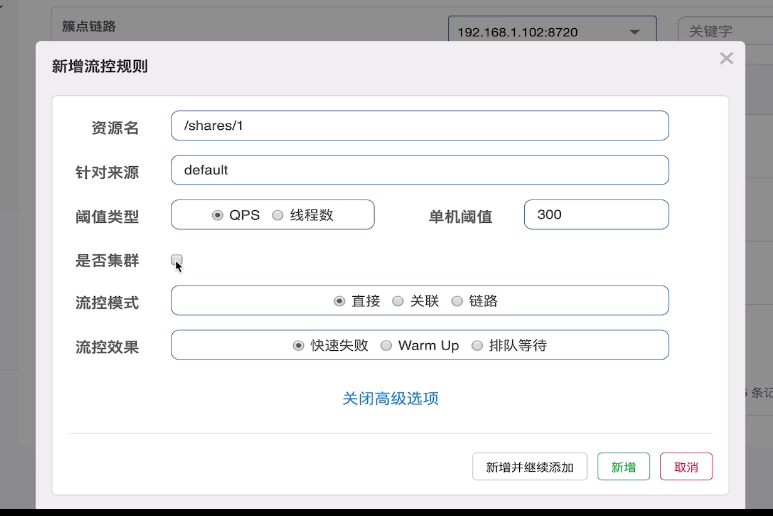
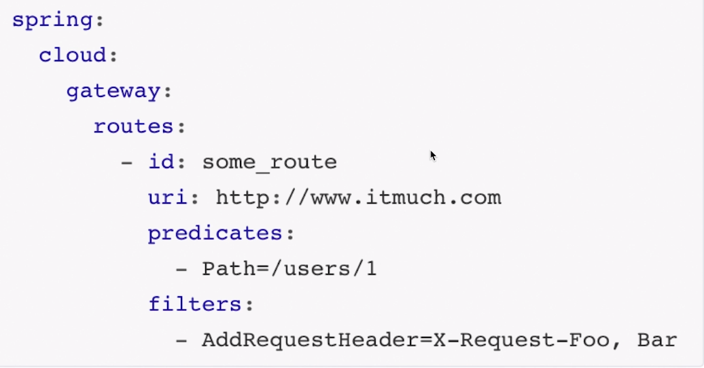
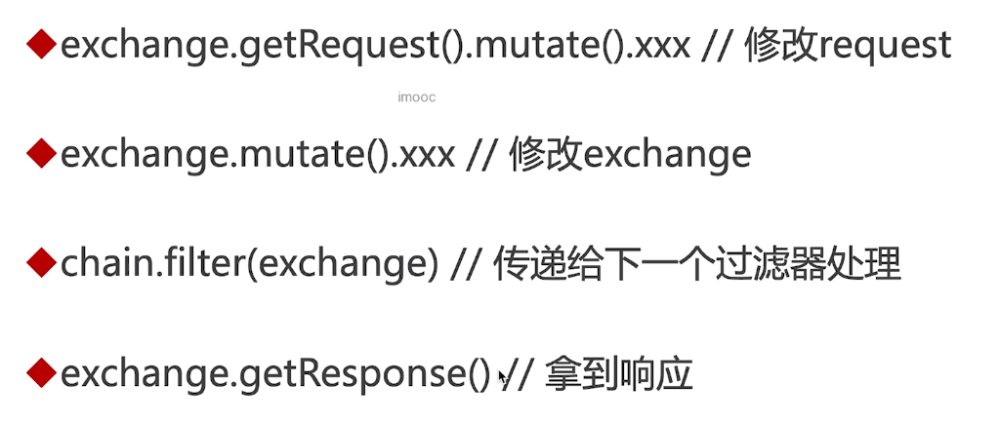

# Spring Cloud ☁️ (alibaba)

## Nacos

服务注册/发现 配置中心

NameSpace-->Group-->Service-->Cluster--->Instance

## Ribbon

| 接口                       | 作用                           |
| -------------------------- | ------------------------------ |
| IClientConfig              | 读取配置                       |
| IRule                      | 负载均衡规则 (轮询,随机.....)  |
| IPing                      | ping 过滤                      |
| ServerList\<Server\>       | 交给 Ribbon 的实例集合         |
| ServerListFilter\<Server\> | 过滤掉不符合条件的实例         |
| ILoadBalancer              | Ribbon 负载均衡入口            |
| ServerListUpdater          | 更新交给 Ribbon 实例集合的策略 |

自定义 Ribbon 配置:

```java
@RabbionClient(name="xxx服务",configuration="xxxxclass")
@RabbionClients(defaultConfiguration="xxxxclass") // 全局配置

xxxclass: IRule/ILoadBalancer....(大部分接口配置都可以重写)   // 放到 spring boot扫描包之外, 防止父子上下文重叠扫描(事务失效)

// 配置文件方式
xxxx:
  ribbon:
    NFLoadBalancerRuleClassName: xxxclass
```

1. ribbon 默认懒加载

   ```java
   ribbon:
    eager-load:
      enabled: true
      clients: xxx服务
   ```

2. 重写 ribbon 负载均衡规则

   ```java
    extends AbstarctRibbonLoadBlancer

    nacosDiscoveryProperties-->namingService--->selectOneHealthy... // nacos提供的基于权重的负载均衡规则
   ```

## Feign

> 声明式 HTTP 客户端

```java
@FelgnClient(name="xxx服务")
interface xxx{

   @GetMapping("/test)
   Object test(....);
}
```

1. Feign 默认 httpclient 没提供连接池
2. 日志: none basic headers all <code>@EnableFeignClients(defaultConfigurations=xxxx)可以指定全局配置</code>

```java
feign:
  client:
    xxx服务: // default 为全局配置
      loggerLevel: xxx
```

3. 支持的配置: 拦截器 重试策略 超时....
4. 不同服务的 feignClient 继承公共接口/dto 对象?
5. 使用 apache httpclient: 额外的依赖+配置 <code>feign.htpclient.enable:true</code>

## Sentinel

[Sentinel](https://github.com/alibaba/Sentinel)

### 流控



1. 关联: 关联的资源达到阈值就限流对自己资源的请求
2. 资源: <code>@SentinelResource("xxxx")</code> 或者请求 uri 也可以当作资源

### 降级

断路器

### 热点规则

1. 方法参数(xxx,zzz,vvvv) , 0,1,2.... , 针对参数维度限流
2. 参数必须为基本类型

### 系统规则

1. load: 系统负载, 建议 cpu 核心\*2.5 <code>uptime</code>
2. RT 线程数 入口 QPS : 都是针对平均值

### 授权规则

限制某个服务 是否能访问某个资源

### API

<code>SphU 定义资源</code>
<code>Tracer 统计异常</code>
<code>ContextUtil 调用来源上下文</code>

### @SentinelResource

```java
blockhandler fallbackhandler

@SentinelRestTemplate

feign.sentinel.enable=true
```

### 支持 restful

> implements UrlCleaner

## Spring Cloud GateWay

[文档](https://spring.io/projects/spring-cloud-gateway)



### RoutePredicate

```java
//自定义规则
- TimeBetween=上午9:00,下午9:00  // 时间格式有限定

class TimeBetweenRoutePredicateFactory extends AbstractRouteFactory<T> // 名称有限制

@override
shortcutFieldOrder // 定义9:00,19:00 如何切分

@override
apply // 是否匹配规则

// T 配置类-->对应 9:00,19:00

class T // 属性对应配置项
```

### Filter 过滤器

```bash
pre / post

# 自定义过滤器
order越小越先执行

1. 过滤器工厂: class 必须GateWayFilterFactory结尾, 这种方式可以在配置文件中指定过滤器
2.  implements GatewayFilter, Ordered
3. implements GlobalFilter, Ordered
```



## 监控

### Sleuth

> 调用链追踪

### ZipKin

> 调用链可视化
