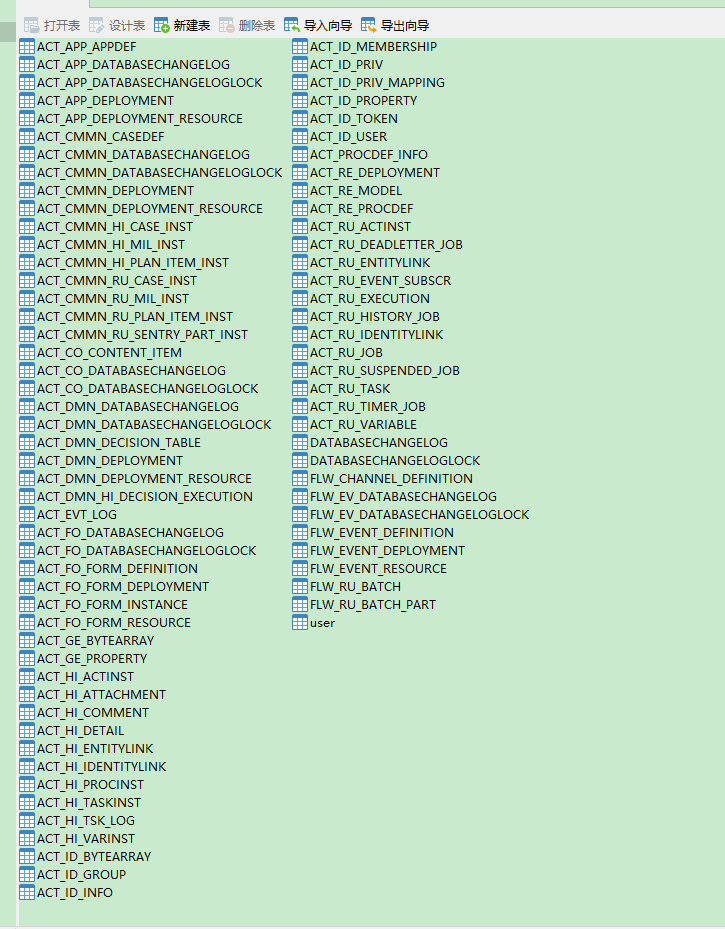

# flowable

> 流程定义 ----> 流程部署 -----> 流程实例

## SpringBoot 整合

```
resource下 processes 目录下的bpmn会自动部署

详细配置参考 文档
```

开启 history 没有禁用 CMMN DMN 等等 数据库表大概这么老些



## RepositoryService

```java
// 流程定义
 repositoryService.createProcessDefinitionQuery()
                .list().forEach(e -> {
            System.out.println(e.getId() + "  " + e.getName());
        });

// holiday01:1:e48a522f-ea8d-11ea-a043-0c5415d4c074  holiday01

repositoryService.createProcessDefinitionQuery()
                .processDefinitionName("holiday01").singleResult();

// 删除流程定义 直接通过流程部署id删    history记录会存在
// true  如果有没跑完的task 一并删除
repositoryService.deleteDeployment("xxxxx",true);


// 流程挂起与激活
holiday.isSuspended();
repositoryService.suspendProcessDefinitionById(String processDefinitionId, boolean suspendProcessInstances, Date suspensionDate);
repositoryService.activateProcessDefinitionById(String processDefinitionId, boolean activateProcessInstances, Date activationDate);
```

## RuntimeService

```java
// 启动一个新的流程实例
// business key ---> 实际 业务表中的某一条记录唯一key
ProcessInstance processInstance = runtimeService.startProcessInstanceById(holiday.getId(),"business key");


// 单个流程实例的挂起与激活
ProcessInstance xxx = runtimeService.createProcessInstanceQuery().processInstanceBusinessKey("business key").singleResult();
xxx.isSuspended();
runtimeService.suspendProcessInstanceById(xxx.getId());
runtimeService.activateProcessInstanceById(xxx.getId());
```

## TaskService

```java
// 流程实例阶段  任务相关操作
List<Task> taskList = taskService.createTaskQuery()
                .processDefinitionId(holiday.getId())   // 流程实例id
                .taskAssignee("zs").list();             // 任务负责人/指派人

        taskList.forEach(e -> {
            System.out.println(e.toString());
        });

// Task[id=747da45e-ea91-11ea-9b21-0c5415d4c074, name=add form]

//完成任务

Task zs = taskService.createTaskQuery()
                .processDefinitionId(holiday.getId())
                .taskAssignee("zs").singleResult();

    taskService.complete(zs.getId());
```

## HistoryService

```java
// 历史记录查询
 List<HistoricActivityInstance> historicActivityInstanceList = historyService.createHistoricActivityInstanceQuery()
                .processDefinitionId(holiday.getId()).list();


        historicActivityInstanceList.forEach(e -> {
            System.out.println(e.getId() + " " + e.getAssignee() + "  " + e.getActivityName() + " " + e.getDurationInMillis());
        });
```

## UEL 表达式

```java

// 任务负责人  Assignee
${assignee}  ${user.assignee}

// 每次启动新的流程实例时,  就要填充 uel变量值
variables.put("assignee","张三")
runtimeService.startProcessInstanceById(String processDefinitionId, String businessKey, Map<String, Object> variables);

```

## 流程变量

> 全局 or 局部变量

```java
// Assignee 或者  流程线上 (Condition)  指定
${price>=100}


// 任务执行时设置 流程变量
// 上一个task 完成时设置
taskService.complete(taskId, variables);
// 为流程实例设置变量
runtimeService.setVariables(processInstanceId,variables);
// 当前任务设置变量
taskService.setVariables(taskId,variables);
```

## Candidate

> 候选人 候选组

<code>Candidate Users</code>

1. 设置多个 , 分隔
2. 查询任务 拾取任务 归还/办理任务

```java
//  zs,lisi,wangwu
List<Task> taskList = taskService.createTaskQuery()
                .processDefinitionId(holiday.getId())   // 流程实例id
                .taskCandidateUser("zs").list();    // 某个 候选用户的任务

// 拾取任务
taskService.claim(taskId,user);   // 任务 taskAsignee  变为某个user

// 归还任务
taskService.setAssignee(taskId,null);

// 任务交接
taskService.setAssignee(taskId,otherUser);
```

<code>Candidate Groups</code>

## GateWay

1. 排他网关

<code>exclusive gateway</code>

> 多个分支都满足条件时 只能选一个分支执行

2. 并行网关

<code>parallel gateway</code>

> fork/join 并行走多个分支 (分支设置了条件也会都忽略), 最后汇聚到一起, 然后下一步

3. 包含网关

<code>inclusive gateway</code>

> 可以并行走多个分支 (分支条件有效, 不符合不走) , 汇聚点 满足条件的分支都完成后 可以下一步
