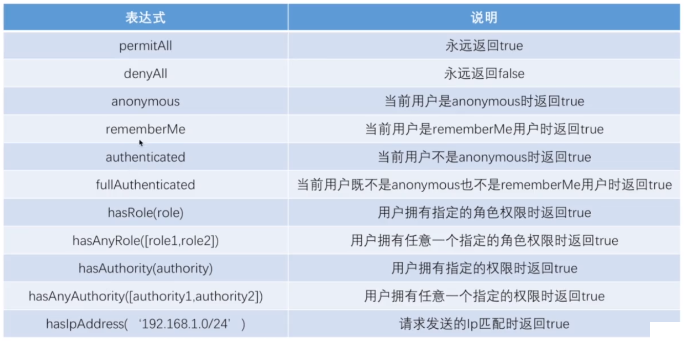

# Security 🌱

核心:一系列的过滤器链

核心过滤器链顺序:

```java
ChannelProcessingFilter, because it might need to redirect to a different protocol
SecurityContextPersistenceFilter, so a SecurityContext can be set up in the SecurityContextHolder at the beginning of a web request, and any changes to the SecurityContext can be copied to the HttpSession when the web request ends (ready for use with the next web request)
ConcurrentSessionFilter, because it uses the SecurityContextHolder functionality and needs to update the SessionRegistry to reflect ongoing requests from the principal
Authentication processing mechanisms - UsernamePasswordAuthenticationFilter, CasAuthenticationFilter, BasicAuthenticationFilter etc - so that the SecurityContextHolder can be modified to contain a valid Authentication request token
The SecurityContextHolderAwareRequestFilter, if you are using it to install a Spring Security aware HttpServletRequestWrapper into your servlet container
The JaasApiIntegrationFilter, if a JaasAuthenticationToken is in the SecurityContextHolder this will process the FilterChain as the Subject in the JaasAuthenticationToken
RememberMeAuthenticationFilter, so that if no earlier authentication processing mechanism updated the SecurityContextHolder, and the request presents a cookie that enables remember-me services to take place, a suitable remembered Authentication object will be put there
AnonymousAuthenticationFilter, so that if no earlier authentication processing mechanism updated the SecurityContextHolder, an anonymous Authentication object will be put there
ExceptionTranslationFilter, to catch any Spring Security exceptions so that either an HTTP error response can be returned or an appropriate AuthenticationEntryPoint can be launched
FilterSecurityInterceptor, to protect web URIs and raise exceptions when access is denied
```

## HttpSecurity

demo

```java
 http.formLogin().loginProcessingUrl("/login")
                .and()
                .authorizeRequests()
                .antMatchers("/login").permitAll() //匹配到的放行
                .anyRequest()
                .authenticated();
```

## UserDetailsService

自定义用户认证逻辑

> UserDetails loadUserByUsername(String username)

User-->实现了 UserDetails, 方法直接返回 User 对象即可

```java
@Service
@Slf4j
public class MyUserDetailService implements UserDetailsService {
    @Override
    public UserDetails loadUserByUsername(String username) throws UsernameNotFoundException {
        log.info("用户名: " + username);
        //.....
        //数据库 获取用户信息

        return new User(username, "123456", AuthorityUtils.commaSeparatedStringToAuthorityList("admin,user"));
    }
}
```

## PasswordEncoder

定义加密/匹配规则

```java
@Bean
    public PasswordEncoder passwordEncoder() {
        return new MyPasswordEncoder();
    }
```

## 自定义登录

登陆成功: AuthenticationSuccessHandler, Authentication 对象包含 UserDetails 的信息
登录失败: AuthenticationFailureHandler

## 认证流程

    1. UsernamePasswordAuthenticationFilter 拦截用户请求
    2. UsernamePasswordAuthenticationToken 封装用户信息
    3. AuthenticationManager 管理一系列的AuthenticationProvider
    4. AuthenticationProvider 自动处理不同的认证类型(普通登录, 短信, ....), 检查userdetail是否可用...., 检查密码匹配, 检查全都通过以后,UsernamePasswordAuthenticationToken.setAuthenticated(true), 通过认证
    5. 最终过滤器链返回一个已认证的 Authentication对象
    6. 认证成功Handler处理
    7. 同一个请求下,可以通过 SecurityContextHolder 获取用户认证信息

## 自定义认证

AuthenticationFilter:

```java
public class SmsCodeAuthenticationFilter extends AbstractAuthenticationProcessingFilter {
	// ~ Static fields/initializers
	// =====================================================================================

	private String mobileParameter = SecurityConstants.DEFAULT_PARAMETER_NAME_MOBILE;
	private boolean postOnly = true;

	// ~ Constructors
	// ===================================================================================================

	public SmsCodeAuthenticationFilter() {
		super(new AntPathRequestMatcher(SecurityConstants.DEFAULT_SIGN_IN_PROCESSING_URL_MOBILE, "POST"));
	}

	// ~ Methods
	// ========================================================================================================

	public Authentication attemptAuthentication(HttpServletRequest request, HttpServletResponse response)
			throws AuthenticationException {
		if (postOnly && !request.getMethod().equals("POST")) {
			throw new AuthenticationServiceException("Authentication method not supported: " + request.getMethod());
		}

		String mobile = obtainMobile(request);

		if (mobile == null) {
			mobile = "";
		}

		mobile = mobile.trim();

		SmsCodeAuthenticationToken authRequest = new SmsCodeAuthenticationToken(mobile);

		// Allow subclasses to set the "details" property
		setDetails(request, authRequest);

		return this.getAuthenticationManager().authenticate(authRequest);
	}


	/**
	 * 获取手机号
	 */
	protected String obtainMobile(HttpServletRequest request) {
		return request.getParameter(mobileParameter);
	}

	/**
	 * Provided so that subclasses may configure what is put into the
	 * authentication request's details property.
	 *
	 * @param request
	 *            that an authentication request is being created for
	 * @param authRequest
	 *            the authentication request object that should have its details
	 *            set
	 */
	protected void setDetails(HttpServletRequest request, SmsCodeAuthenticationToken authRequest) {
		authRequest.setDetails(authenticationDetailsSource.buildDetails(request));
	}

	/**
	 * Sets the parameter name which will be used to obtain the username from
	 * the login request.
	 *
	 * @param usernameParameter
	 *            the parameter name. Defaults to "username".
	 */
	public void setMobileParameter(String usernameParameter) {
		Assert.hasText(usernameParameter, "Username parameter must not be empty or null");
		this.mobileParameter = usernameParameter;
	}


	/**
	 * Defines whether only HTTP POST requests will be allowed by this filter.
	 * If set to true, and an authentication request is received which is not a
	 * POST request, an exception will be raised immediately and authentication
	 * will not be attempted. The <tt>unsuccessfulAuthentication()</tt> method
	 * will be called as if handling a failed authentication.
	 * <p>
	 * Defaults to <tt>true</tt> but may be overridden by subclasses.
	 */
	public void setPostOnly(boolean postOnly) {
		this.postOnly = postOnly;
	}

	public final String getMobileParameter() {
		return mobileParameter;
	}

}

```

AuthenticationProvider:

```java
public class SmsCodeAuthenticationProvider implements AuthenticationProvider {

	private UserDetailsService userDetailsService;

	/*
	 * (non-Javadoc)
	 *
	 * @see org.springframework.security.authentication.AuthenticationProvider#
	 * authenticate(org.springframework.security.core.Authentication)
	 */
	@Override
	public Authentication authenticate(Authentication authentication) throws AuthenticationException {

		SmsCodeAuthenticationToken authenticationToken = (SmsCodeAuthenticationToken) authentication;

		UserDetails user = userDetailsService.loadUserByUsername((String) authenticationToken.getPrincipal());

		if (user == null) {
			throw new InternalAuthenticationServiceException("无法获取用户信息");
		}

		SmsCodeAuthenticationToken authenticationResult = new SmsCodeAuthenticationToken(user, user.getAuthorities());

		authenticationResult.setDetails(authenticationToken.getDetails());

		return authenticationResult;
	}

	/*
	 * (non-Javadoc)
	 *
	 * @see org.springframework.security.authentication.AuthenticationProvider#
	 * supports(java.lang.Class)
	 */
	@Override
	public boolean supports(Class<?> authentication) {
		return SmsCodeAuthenticationToken.class.isAssignableFrom(authentication);
	}

	public UserDetailsService getUserDetailsService() {
		return userDetailsService;
	}

	public void setUserDetailsService(UserDetailsService userDetailsService) {
		this.userDetailsService = userDetailsService;
	}

}
```

AuthenticationToken:

```java
public class SmsCodeAuthenticationToken extends AbstractAuthenticationToken {

	private static final long serialVersionUID = SpringSecurityCoreVersion.SERIAL_VERSION_UID;

	// ~ Instance fields
	// ================================================================================================

	private final Object principal;

	// ~ Constructors
	// ===================================================================================================

	/**
	 * This constructor can be safely used by any code that wishes to create a
	 * <code>UsernamePasswordAuthenticationToken</code>, as the {@link #isAuthenticated()}
	 * will return <code>false</code>.
	 *
	 */
	public SmsCodeAuthenticationToken(String mobile) {
		super(null);
		this.principal = mobile;
		setAuthenticated(false);
	}

	/**
	 * This constructor should only be used by <code>AuthenticationManager</code> or
	 * <code>AuthenticationProvider</code> implementations that are satisfied with
	 * producing a trusted (i.e. {@link #isAuthenticated()} = <code>true</code>)
	 * authentication token.
	 *
	 * @param principal
	 * @param credentials
	 * @param authorities
	 */
	public SmsCodeAuthenticationToken(Object principal,
			Collection<? extends GrantedAuthority> authorities) {
		super(authorities);
		this.principal = principal;
		super.setAuthenticated(true); // must use super, as we override
	}

	// ~ Methods
	// ========================================================================================================

	public Object getCredentials() {
		return null;
	}

	public Object getPrincipal() {
		return this.principal;
	}

	public void setAuthenticated(boolean isAuthenticated) throws IllegalArgumentException {
		if (isAuthenticated) {
			throw new IllegalArgumentException(
					"Cannot set this token to trusted - use constructor which takes a GrantedAuthority list instead");
		}

		super.setAuthenticated(false);
	}

	@Override
	public void eraseCredentials() {
		super.eraseCredentials();
	}
}
```

配置:

```java
public class SmsCodeAuthenticationSecurityConfig extends SecurityConfigurerAdapter<DefaultSecurityFilterChain, HttpSecurity> {

	@Autowired
	private AuthenticationSuccessHandler testAuthenticationSuccessHandler;

	@Autowired
	private AuthenticationFailureHandler testAuthenticationFailureHandler;

	@Autowired
	private UserDetailsService userDetailsService;

	@Autowired
	private PersistentTokenRepository persistentTokenRepository;

	/* (non-Javadoc)
	 * @see org.springframework.security.config.annotation.SecurityConfigurerAdapter#configure(org.springframework.security.config.annotation.SecurityBuilder)
	 */
	@Override
	public void configure(HttpSecurity http) throws Exception {

		SmsCodeAuthenticationFilter smsCodeAuthenticationFilter = new SmsCodeAuthenticationFilter();
		smsCodeAuthenticationFilter.setAuthenticationManager(http.getSharedObject(AuthenticationManager.class));
		smsCodeAuthenticationFilter.setAuthenticationSuccessHandler(testAuthenticationSuccessHandler);
		smsCodeAuthenticationFilter.setAuthenticationFailureHandler(testAuthenticationFailureHandler);
		String key = UUID.randomUUID().toString();
		smsCodeAuthenticationFilter.setRememberMeServices(new PersistentTokenBasedRememberMeServices(key, userDetailsService, persistentTokenRepository));

		SmsCodeAuthenticationProvider smsCodeAuthenticationProvider = new SmsCodeAuthenticationProvider();
		smsCodeAuthenticationProvider.setUserDetailsService(userDetailsService);

		http.authenticationProvider(smsCodeAuthenticationProvider)
			.addFilterAfter(smsCodeAuthenticationFilter, UsernamePasswordAuthenticationFilter.class);

//

	}

}

```

## 授权

授权表达式:



## Shiro

```java
@Configuration
public class ShiroConfig {

    @Bean("hashedCredentialsMatcher")
    public HashedCredentialsMatcher hashedCredentialsMatcher() {
        HashedCredentialsMatcher credentialsMatcher =
            new HashedCredentialsMatcher();
        //指定加密方式为MD5
        credentialsMatcher.setHashAlgorithmName("MD5");
        //加密次数
        credentialsMatcher.setHashIterations(1024);
        credentialsMatcher.setStoredCredentialsHexEncoded(true);
        return credentialsMatcher;
    }

    @Bean("userRealm")
    public UserRealm userRealm(@Qualifier("hashedCredentialsMatcher")
                               HashedCredentialsMatcher matcher) {

        UserRealm userRealm = new UserRealm();
        userRealm.setCredentialsMatcher(matcher);
        return userRealm;
    }

    @Bean
    public ShiroFilterFactoryBean shirFilter(@Qualifier("securityManager")
                               DefaultWebSecurityManager securityManager) {

        ShiroFilterFactoryBean bean = new ShiroFilterFactoryBean();
        // 设置 SecurityManager
        bean.setSecurityManager(securityManager);
		// 设置登录成功跳转Url
        bean.setSuccessUrl("/main");
        // 设置登录跳转Url
        bean.setLoginUrl("/toLogin");
        // 设置未授权提示Url
        bean.setUnauthorizedUrl("/error/unAuth");

        /**
         * anon：匿名用户可访问
         * authc：认证用户可访问
         * user：使用rememberMe可访问
         * perms：对应权限可访问
         * role：对应角色权限可访问
         **/
        Map<String, String> filterMap = new LinkedHashMap<>();
        filterMap.put("/login","anon");
        filterMap.put("/user/index","authc");
        filterMap.put("/vip/index","roles[vip]");
        filterMap.put("/druid/**", "anon");
        filterMap.put("/static/**","anon");

        filterMap.put("/**","authc");
        filterMap.put("/logout", "logout");

        bean.setFilterChainDefinitionMap(filterMap);
        return bean;
    }

    /**
     * 注入 securityManager
     */
    @Bean(name="securityManager")
    public DefaultWebSecurityManager getDefaultWebSecurityManager(
        HashedCredentialsMatcher hashedCredentialsMatcher) {

        DefaultWebSecurityManager securityManager =
            new DefaultWebSecurityManager();
        // 关联realm.
        securityManager.setRealm(userRealm(hashedCredentialsMatcher));
        return securityManager;
    }
}
```

Realm:

```java
public class UserRealm extends AuthorizingRealm {

    @Autowired
    private UserService userService;

    /**
     * 用户授权
     **/
    @Override
    protected AuthorizationInfo doGetAuthorizationInfo(
        PrincipalCollection principalCollection) {

        System.out.println("===执行授权===");

        Subject subject = SecurityUtils.getSubject();
        UserBean user = (UserBean)subject.getPrincipal();
        if(user != null){
            SimpleAuthorizationInfo info = new SimpleAuthorizationInfo();
            // 角色与权限字符串集合
            Collection<String> rolesCollection = new HashSet<>();
            Collection<String> premissionCollection = new HashSet<>();
			// 读取并赋值用户角色与权限
            Set<RoleBean> roles = user.getRole();
            for(RoleBean role : roles){
                rolesCollection.add(role.getName());
                Set<PermissionBean> permissions = role.getPermissions();
                for (PermissionBean permission : permissions){
                    premissionCollection.add(permission.getUrl());
                }
                info.addStringPermissions(premissionCollection);
            }
            info.addRoles(rolesCollection);
            return info;
        }
        return null;
    }

    /**
     * 用户认证
     **/
    @Override
    protected AuthenticationInfo doGetAuthenticationInfo(
        AuthenticationToken authenticationToken) throws AuthenticationException {

        System.out.println("===执行认证===");

        UsernamePasswordToken token = (UsernamePasswordToken)authenticationToken;
        UserBean bean = userService.findByName(token.getUsername());

        if(bean == null){
            throw new UnknownAccountException();
        }

        ByteSource credentialsSalt = ByteSource.Util.bytes(bean.getName());

        return new SimpleAuthenticationInfo(bean, bean.getPassword(),
                credentialsSalt, getName());
    }

    // 模拟Shiro用户加密，假设用户密码为123456
    public static void main(String[] args){
        // 用户名
        String username = "demo";
        // 用户密码
        String password = "123456";
        // 加密方式
        String hashAlgorithName = "MD5";
        int hashIterations = 1024;
        ByteSource credentialsSalt = ByteSource.Util.bytes(username);
        Object obj = new SimpleHash(hashAlgorithName, password,
                                    credentialsSalt, hashIterations);
        System.out.println(obj);
    }
}
```

## Google Authenticator

```java
public class GoogleAuthenticator {

    // 密钥长度
    public static final int SECRET_SIZE = 10;
	// 计时器种子
    public static final String SEED = "xxxxxxxxxxxxxxxxxxxxxxxxxxxxxxx";
    // 随机数算法
    public static final String RANDOM_NUMBER_ALGORITHM = "SHA1PRNG";
    // 时间窗口
    int window_size = 3; // 3--17

    public void setWindowSize(int s) {
        if (s >= 3 && s <= 17)
            window_size = s;
    }


	// 生成密钥
    public static String generateSecretKey() {
        SecureRandom sr = null;
        try {
            sr = SecureRandom.getInstance(RANDOM_NUMBER_ALGORITHM);
            sr.setSeed(Base64.decodeBase64(SEED));
            byte[] buffer = sr.generateSeed(SECRET_SIZE);
            Base32 codec = new Base32();
            byte[] bEncodedKey = codec.encode(buffer);
            String encodedKey = new String(bEncodedKey);
            return encodedKey;
        } catch (NoSuchAlgorithmException e) {
			e.printStackTrace();
        }
        return null;
    }

    // 生成二维码url
    public static String getQRBarcodeURL(String user, String host, String secret) {
        String format = "http://www.google.com/chart?chs=200x200&chld=M%%7C0&cht=qr&chl=otpauth://totp/%s@%s?secret=%s";
        return String.format(format, user, host, secret);
    }

    // 二维码内容
    public static String getQRBarcode(String user, String secret) {
        String format = "otpauth://totp/%s?secret=%s";
        return String.format(format, user, secret);
    }

    // 验证 code
    public boolean check_code(String secret, long code, long timeMsec) {
        Base32 codec = new Base32();
        byte[] decodedKey = codec.decode(secret);
        long t = (timeMsec / 1000L) / 30L;
        for (int i = -window_size; i <= window_size; ++i) {
            long hash;
            try {
                hash = verify_code(decodedKey, t + i);
            } catch (Exception e) {
                e.printStackTrace();
                throw new RuntimeException(e.getMessage());
            }
            if (hash == code) {
                return true;
            }
        }
        return false;
    }

	// 验证code的具体算法
    private static int verify_code(byte[] key, long t) throws NoSuchAlgorithmException, InvalidKeyException {
        byte[] data = new byte[8];
        long value = t;
        for (int i = 8; i-- > 0; value >>>= 8) {
            data[i] = (byte) value;
        }
        SecretKeySpec signKey = new SecretKeySpec(key, "HmacSHA1");
        Mac mac = Mac.getInstance("HmacSHA1");
        mac.init(signKey);
        byte[] hash = mac.doFinal(data);
        int offset = hash[20 - 1] & 0xF;
        long truncatedHash = 0;
        for (int i = 0; i < 4; ++i) {
            truncatedHash <<= 8;
            truncatedHash |= (hash[offset + i] & 0xFF);
        }
        truncatedHash &= 0x7FFFFFFF;
        truncatedHash %= 1000000;
        return (int) truncatedHash;
    }
}
```
