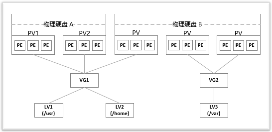

## LVM磁盘管理

> 物理硬盘 --> 物理卷 PV --> 卷组 VG --> 逻辑卷 LV --> 挂载



```bash
# gpt 分区
gdisk /dev/sdn

# ...

# 创建PV卷

pvcreate /dev/sdn /dev/sdx

# 卷组

vgcreate -s 32M xxx /dev/sdn  # -s PE最小块大小  4M整数倍

# 逻辑卷

lvcreate -L 15G -n xxxx1  xxxx2 # -L 容量大小

# 格式化逻辑卷

mkfs.ext4 /dev/xxx/xxxx1   # /dev目录下会存在  卷组名/逻辑卷名的路径

# 挂载 /dev/xxx/xxxx1 到具体目录上

# 自动挂载 /etc/fstab 增加
/dev/xxx/xxxx1 /data       ext4    defaults       0       0


# 扩展/缩小逻辑卷
lvextend -L +50G /dev/xxx/xxxx1   # 增加50G
lvreduce -L -50G /dev/xxx/xxxx1   # 减小50G

# 更新
resize2fs /dev/xxx/xxxx1  # etx格式
xfs_growfs /dev/xxx/xxx1  # xfs格式
```


## rsync 同步

```bash
# 远程 ----> 本地  root@xxx:/xxx  /home.....
rsync -arPu --exclude 'demo1/' --exclude 'demo2/' --exclude 'demo3/' root@202.60.245.163:/root/test /root
```