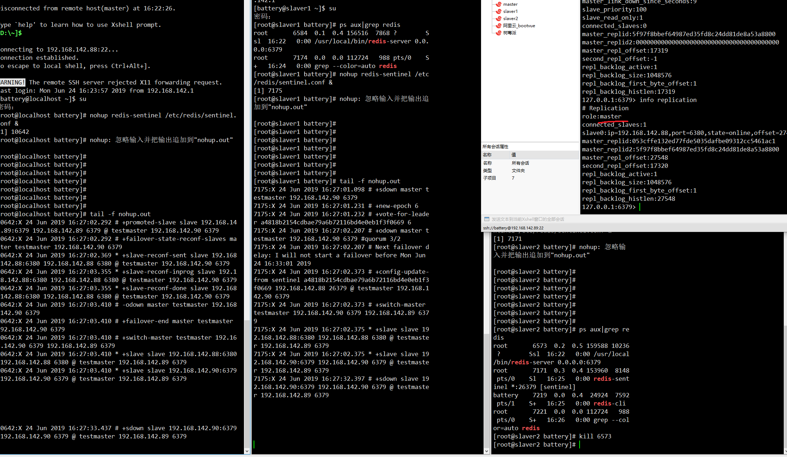

# 其它

乱七八糟 💣💣💣

## systemctl 服务

> /usr/lib/systemd/下, 开机不登录就能启动的服务最好放在 /usr/lib/systemd/system 系统服务, .../user: 用户服务 需要用户登录才可以启动

```bash
# [Unit]、[Service]和[Install]
[Unit]   # 主要是服务说明
Description=test   # 简单描述服务
After=network.target    # 描述服务类别，表示本服务需要在network服务启动后在启动
Before=xxx.service      # 表示需要在某些服务启动之前启动，After和Before字段只涉及启动顺序，不涉及依赖关系

[Service]  # 核心区域
Type=forking     # 表示后台运行模式。
User=root        # 设置服务运行的用户
Group=root       # 设置服务运行的用户组
KillMode=control-group   # 定义systemd如何停止服务
PIDFile=/usr/local/test/test.pid    # 存放PID的绝对路径
Restart=no        # 定义服务进程退出后，systemd的重启方式，默认是不重启
ExecStart=/usr/local/test/bin/startup.sh    # 服务启动命令，命令需要绝对路径
ExecReload=/xxxxx
ExecStop=/xxxxx
PrivateTmp=true                               # 表示给服务分配独立的临时空间

[Install]
WantedBy=multi-user.target  # 多用户

#Type的类型有：
#    simple(默认）：# 以ExecStart字段启动的进程为主进程
#    forking:  # ExecStart字段以fork()方式启动，此时父进程将退出，子进程将成为主进程（后台运行）。一般都设置为forking
#    oneshot:  # 类似于simple，但只执行一次，systemd会等它执行完，才启动其他服务
#    dbus：    # 类似于simple, 但会等待D-Bus信号后启动
#    notify:   # 类似于simple, 启动结束后会发出通知信号，然后systemd再启动其他服务
#    idle：    # 类似于simple，但是要等到其他任务都执行完，才会启动该服务。
#
#EnvironmentFile:
#    指定配置文件，和连词号组合使用，可以避免配置文件不存在的异常。
#
#Environment:
#    后面接多个不同的shell变量。
#    例如：
#    Environment=DATA_DIR=/data/elk
#    Environment=LOG_DIR=/var/log/elasticsearch
#    Environment=PID_DIR=/var/run/elasticsearch
#    EnvironmentFile=-/etc/sysconfig/elasticsearch
#
#连词号（-）：在所有启动设置之前，添加的变量字段，都可以加上连词号
#    表示抑制错误，即发生错误时，不影响其他命令的执行。
#    比如`EnviromentFile=-/etc/sysconfig/xxx` 表示即使文件不存在，也不会抛异常
#
#KillMode的类型：
#    control-group(默认)：# 当前控制组里的所有子进程，都会被杀掉
#    process: # 只杀主进程
#    mixed:   # 主进程将收到SIGTERM信号，子进程收到SIGKILL信号
#    none:    # 没有进程会被杀掉，只是执行服务的stop命令
#Restart的类型：
#    no(默认值)： # 退出后无操作
#    on-success:  # 只有正常退出时（退出状态码为0）,才会重启
#    on-failure:  # 非正常退出时，重启，包括被信号终止和超时等
#    on-abnormal: # 只有被信号终止或超时，才会重启
#    on-abort:    # 只有在收到没有捕捉到的信号终止时，才会重启
#    on-watchdog: # 超时退出时，才会重启
#    always:      # 不管什么退出原因，都会重启
#    # 对于守护进程，推荐用on-failure
#RestartSec字段：
#    表示systemd重启服务之前，需要等待的秒数：RestartSec: 30
#
#各种Exec*字段：
#    # Exec* 后面接的命令，仅接受“指令 参数 参数..”格式，不能接受<>|&等特殊字符，很多bash语法也不支持。如果想支持bash语法，需要设置Tyep=oneshot
#    ExecStart：    # 启动服务时执行的命令
#    ExecReload：   # 重启服务时执行的命令
#    ExecStop：     # 停止服务时执行的命令
#    ExecStartPre： # 启动服务前执行的命令
#    ExecStartPost：# 启动服务后执行的命令
#    ExecStopPost： # 停止服务后执行的命令
#
#
#WantedBy字段：
#    multi-user.target: # 表示多用户命令行状态，这个设置很重要
#    graphical.target:  # 表示图形用户状体，它依赖于multi-user.target
```

## 并发编程

`Executors` 线程池 `newFixedThreadPool` `newCachedThreadPool` `newSingleThreadExecutor` `newScheduledThreadPool`, 最好通过`ThreadPoolExecutor`创建线程池

方法: `execute(Runable)` `shutdown()` `Future<T> submit(Callable)`

`Future` 方法`isDone()`判断任务是否执行完成, `get()`获取结果 `cancel()`取消任务

## 函数式编程

`Function`: 两个方法 apply andThen
`Consumer`: accept 方法
`Predicate` test 方法
`Supplier`: get 方法

## MySQL 分区

1. range: 给定一个连续区间的范围值进行分区

```sql
-- 语法
create table <table> (
    // 字段
) ENGINE=MyISAM  DEFAULT CHARSET=utf8 AUTO_INCREMENT=1
partition by range (分区字段) (
  partition <分区名称> values less than (Value),
  partition <分区名称> values less than (Value),
  ...
  partition <分区名称> values less than maxvalue
);
```

2. list: 设置若干个固定值进行分区，如果某个字段的值在这个设置的值列表中就会被分配到该分区

```sql
-- 语法
create table <table> (
    // 字段
) ENGINE=数据库引擎  DEFAULT CHARSET=utf8 AUTO_INCREMENT=1
partition by LIST (分区字段或者基于该字段的返回的整数值的表达式) (
  partition <分区名称> values IN (Value1，Value2, Value3),
  ...
  partition <分区名称> values IN (Value4, Value5),
);
```

3. columns 分区: columns 分区分为 range columns 和 list columns 两种，支持整数(tinyint 到 bigint， 不支持 decimal 和 float)、日期(date、datetime)、字符串(char、varchar、binary、varbinary)三大数据类型

```sql
partition by range columns(a, b) (
   partition p01 values less than (0, 10),
   partition p02 values less than (10, 10),
   partition p03 values less than (10, 20),
   partition p04 values less than (10, 35),
   partition p05 values less than (10, maxvalue),
   partition p06 values less than (maxvalue, maxvalue),
);
```

4. hash 分区: 对分区键应用一个散列函数，以此确定数据应当放在 N 个分区中的哪个分区

```sql
-- HASH
create table <table> (
    // 字段
) ENGINE=innodb  DEFAULT CHARSET=utf8 AUTO_INCREMENT=1
PARTITION BY HASH(expr)
PARTITIONS <num>;
```

5. key 分区: key 分区不允许使用用于自定义的表达式，需要使用 mysql 服务器提供的 hash 函数，同时 hash 分区只支持整数分区，而 key 分区支持使用 blob or text 类型外的其他类型的列作为分区键

```sql
partition by key(expr) partitions num;

-- 不指定默认首选主键作为分区键，在没有主键的情况下会选择非空唯一键作为分区键
partition by key() partitions num;

-- linear key
partition by linear key(expr)
```

## Redis

缓存策略:

开启内存限制 `maxmemory bytes`

```bash
noeviction: 不删除策略, 达到最大内存限制时, 如果需要更多内存, 直接返回错误信息。
allkeys-lru: 所有key通用; 优先删除最近最少使用(less recently used ,LRU) 的 key
volatile-lru: 只限于设置了 expire 的部分; 优先删除最近最少使用(less recently used ,LRU) 的 key
allkeys-random: 所有key通用; 随机删除一部分 key
volatile-random: 只限于设置了 expire 的部分; 随机删除一部分 key
volatile-ttl: 只限于设置了 expire 的部分; 优先删除剩余时间(time to live,TTL) 短的key
```

RDB: 手动/自动触发,dump 快照方式, save m n: 表示 m 秒之内数据集存在 n 次修改时，自动触发 bgsave
AOF: 独立 log 日志记录写操作 always:每次写操作都记录 everysec: 1 秒同步记录一次 no:不同步记录

redis 密码配置 requirepass xxx
主从配置 slaveof ip port
master 有密码的话 masterauth xxx

哨兵配置 sentinel.conf
sentinel monitor master_name ip port 票数(1,2....) ------>监听 master, 集群下保证 master_name 一致, 最好每个节点都放一个 sentinel.conf
启动哨兵 redis-sentinel /.....sentinel.conf
有 redis-server 挂掉, 哨兵会重新选择 master



spring boot 配置哨兵:

```yml
spring:
  redis:
    sentinel:
      master: testmaster
      nodes: 192.168.142.88:26379,192.168.142.89:26379,192.168.142.90:26379
```

## Rabbit

### 注意:

1. 如果不指定 exchange, 默认走 amqp default exchange, ==routing-key==与==queue==名匹配一致投递

### exchange 交换机

1. direct: ==routing-key==必须完全匹配
2. topic: ==routing-key==模糊匹配

> #匹配多个词 \*匹配一个词

3. fanout: ==不处==理 routing-key, exchange 与 queue 直接绑定

### message 消息

1. 可以携带 properties 属性
2. ==mandotary===true, 发送端会监听到路由不到的消息, 即 returnCallback, =false 时, 路由不到的消息会被自动删除
3. 发送端要处理==confirmCallback== ==returnCallback==, 配置里这两项必须设为 true
4.

### 死信队列(特殊的 exchange)

1. 消息被 nack 并且 requeue=false
2. ttl 消息过期
3. 队列达到最大长度

```bash
私信: 就是普通的exchange-->queue绑定

业务queue 添加额外的参数: x-dead-letter-exchange=死信交换机

这样业务queue上未消费的消息就路由到了私信交换机上
```

### 消费者

```java
@Component
public class Consumer {

    @RabbitListener(bindings = @QueueBinding(value = @Queue(name = "test.queue", durable = "true", autoDelete = "true"),
            exchange = @Exchange(name = "test.exchange", durable = "true", autoDelete = "true", type = "topic"),
            key = "test.#"))
    @RabbitHandler
    public void test(Message message, Channel channel) {
        byte[] body = message.getBody();
        System.out.println(new String(body));


    }
}
```

### 监听器

1. simpleMessageListenerContainer

为队列添加监听事件

2. messageListenerAdapter 消息适配器

   处理方法 可以为每个队列指定不同的处理方法

3. messageConvert 消息转化器 java 对象与 message 对象互转

### 高可用

1. 镜像队列 : 配置 1 个 Master, 多个 Slaver

   ```txt
    1. master节点 /var/lib/rabbitmq/.erlang.cookie 拷贝到各个节点
    2. 启动服务 rabbitmq-server -detached
    3. 备用节点停止服务 rabbitmqctl stop_app
    4. 备用节点加入到主节点集群中 rabbitmqctl join_cluster rabbit@xxxx(hosts名)
    5. 备用节点启动 rabbitmqctl start_app
    6. 任意节点设置集群名 rabbitmqctl set_cluster_name xxxx
    7. 查看集群状态 rabbitmqctl cluster_status
    8. 配置镜像队列: rabbitmqctl set_policy ha-all "^" '{"ha-mode":"all}'
   ```

2. haproxy: 负载均衡

### 插件

1. 延时插件`rabbitmq_delayed_message_exchange`
   ```bash
    1. /usr/lib/rabbitmq/lib/rabbitmq_serverxxx/plugins
    2. rabbitmq-plugins enable xxxx
    3. 声明一个x-delayed-type类型的exchange
    4. 发送消息时,消息headers需要指定x-delay=xx毫秒
   ```

## Spring 事务

隔离级别:

```
ISOLATION_DEFAULT	使用后端数据库默认的隔离级别
ISOLATION_READ_UNCOMMITTED	允许读取尚未提交的更改。可能导致脏读、幻读或不可重复读
ISOLATION_READ_COMMITTED	允许从已经提交的并发事务读取。可防止脏读，但幻读和不可重复读仍可能会发生
ISOLATION_REPEATABLE_READ	对相同字段的多次读取的结果是一致的，除非数据被当前事务本身改变。可防止脏读和不可重复读，但幻读仍可能发生
ISOLATION_SERIALIZABLE	完全服从ACID的隔离级别，确保不发生脏读、不可重复读和幻读。这在所有隔离级别中也是最慢的，因为它通常是通过完全锁定当前事务所涉及的数据表来完成的, 可以加共享锁(不排他), 一个事务不释放,其它事务只能读数据
```

传播机制:

```
PROPAGATION_MANDATORY	表示该方法必须运行在一个事务中。如果当前没有事务正在发生，将抛出一个异常
PROPAGATION_NESTED	表示如果当前正有一个事务在进行中，则该方法应当运行在一个嵌套式事务中。被嵌套的事务可以独立于封装事务进行提交或回滚。如果封装事务不存在，行为就像PROPAGATION_REQUIRES一样。
PROPAGATION_NEVER	表示当前的方法不应该在一个事务中运行。如果一个事务正在进行，则会抛出一个异常。
PROPAGATION_NOT_SUPPORTED	表示该方法不应该在一个事务中运行。如果一个现有事务正在进行中，它将在该方法的运行期间被挂起。
PROPAGATION_SUPPORTS	表示当前方法不需要事务性上下文，但是如果有一个事务已经在运行的话，它也可以在这个事务里运行。
PROPAGATION_REQUIRES_NEW	表示当前方法必须在它自己的事务里运行。一个新的事务将被启动，而且如果有一个现有事务在运行的话，则将在这个方法运行期间被挂起。
PROPAGATION_REQUIRES	表示当前方法必须在一个事务中运行。如果一个现有事务正在进行中，该方法将在那个事务中运行，否则就要开始一个新事务。
```

## SpringMvc 异步处理

Callable 多线程模式: 主线程不会被长时间阻塞

```java
@GetMapping("/demo")
    public Callable<String> demo() throws InterruptedException {

        Callable<String> callable = new Callable<String>() {
            @Override
            public String call() throws Exception {
                Thread.sleep(3000);
                return "success";
            }
        };
        return callable;
    }
```

DeferredResult: 接受请求--->处理任务| |处理完毕-->响应结果

## Dockerfile

```docker
from  必须是第一行
maintainer 作者信息
add copy 拷贝文件, add功能更多, 你猜都有什么功能?
run  构建时的命令
expose  暴露端口,只是建议,    实际使用时还需要手动-p  指定端口映射
workdir 指定工作目录 容器启动时执行的命令会在该目录下执行
cmd  运行时命令,  会被使用时容器的命令覆盖
entrypoint  不会被容器运行时命令覆盖
```

> ADD COPY ENV EXPOSE FROM LABEL STOPSIGNAL USER VOLUME WORKDIR

1. 构建 docker 镜像

```bash
docker build -t tag名称 .
. 指定Dockerfile所在路径
```

2. 登录到 hub

```bash
docker login
```

3. 推送

```bash
docker push [OPTIONS] NAME[:TAG]
```

## Gradle

gradle 任务: 往 nexus 发布 jar

```groovy
//Maven仓库的URL
def MAVEN_REPO_RELEASE_URL= 'http://xxxx/nexus/content/repositories/releases/'
def MAVEN_REPO_SNAPSHOT_URL= 'http://xxxxx/nexus/content/repositories/snapshots/'
//登录nexus 的用户名
def NEXUS_USERNAME='admin'
//登录nexus 的密码
def NEXUS_PASSWORD='admin'
def ARTIFACT_ID = 'demo'
// type
def TYPE = 'jar'
//description
def DESCRIPTION = '这里是描述'

uploadArchives {
    configuration = configurations.archives
    repositories {
        mavenDeployer {
            snapshotRepository(url: MAVEN_REPO_SNAPSHOT_URL) {
                authentication(userName: NEXUS_USERNAME, password: NEXUS_PASSWORD)
            }
            repository(url: MAVEN_REPO_RELEASE_URL) {
                authentication(userName: NEXUS_USERNAME, password: NEXUS_PASSWORD)
            }
            repository(url: uri('C:\\Users\\dd\\.m2\\repository')) //定义本地maven仓库的地址
            repository(url: uri('C:\\Users\\dd\\.gradle\\caches\\modules-2\\files-2.1')) //定义本地Gradle仓库的地址
            pom.project {
                version version
                artifactId ARTIFACT_ID
                groupId group
                packaging TYPE
                description DESCRIPTION
                licenses {  
                    license {  
                        name 'The Apache Software License, Version 2.0'  
                        url 'http://www.apache.org/licenses/LICENSE-2.0.txt'  
                        distribution 'xxxxxx'  
                    }  
                }  
            }
        }
    }
}
```