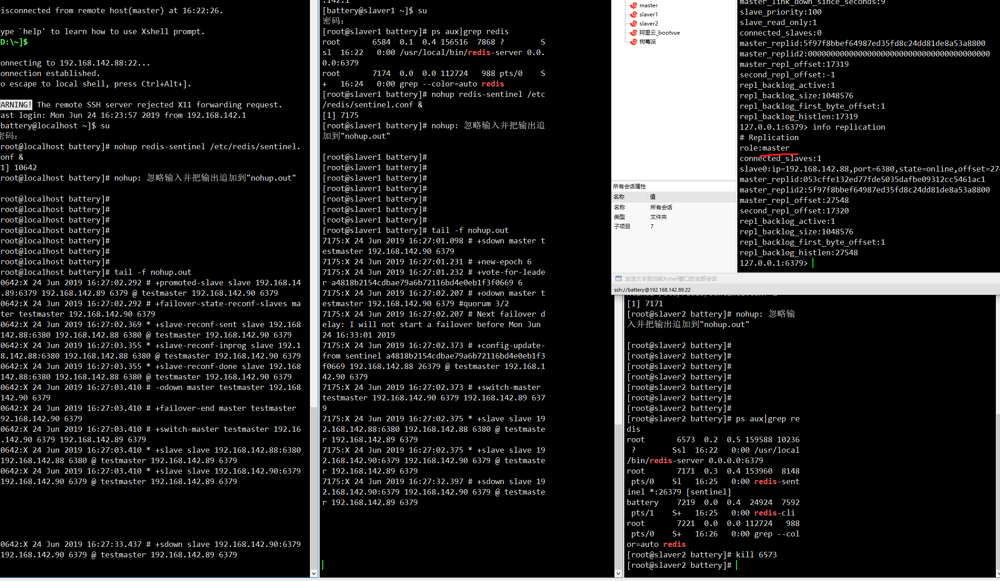

# Redisson

嘿嘿嘿


## Redis

```bash
redis-cli > info clients
redis-cli > client list
redis-cli > config get timeout

1) "timeout"
2) "0" #0表示不开启空闲清除
设置空闲清理时间

redis-cli > config set timeout 600
```

### 缓存策略:

开启内存限制 `maxmemory bytes`

```bash
noeviction: 不删除策略, 达到最大内存限制时, 如果需要更多内存, 直接返回错误信息。
allkeys-lru: 所有key通用; 优先删除最近最少使用(less recently used ,LRU) 的 key
volatile-lru: 只限于设置了 expire 的部分; 优先删除最近最少使用(less recently used ,LRU) 的 key
allkeys-random: 所有key通用; 随机删除一部分 key
volatile-random: 只限于设置了 expire 的部分; 随机删除一部分 key
volatile-ttl: 只限于设置了 expire 的部分; 优先删除剩余时间(time to live,TTL) 短的key
```

RDB: 手动/自动触发,dump 快照方式, save m n: 表示 m 秒之内数据集存在 n 次修改时，自动触发 bgsave
AOF: 独立 log 日志记录写操作 always:每次写操作都记录 everysec: 1 秒同步记录一次 no:不同步记录

redis 密码配置 requirepass xxx
主从配置 slaveof ip port
master 有密码的话 masterauth xxx

哨兵配置 sentinel.conf
sentinel monitor master_name ip port 票数(1,2....) ------>监听 master, 集群下保证 master_name 一致, 最好每个节点都放一个 sentinel.conf
启动哨兵 redis-sentinel /.....sentinel.conf
有 redis-server 挂掉, 哨兵会重新选择 master



spring boot 配置哨兵:

```yml
spring:
  redis:
    sentinel:
      master: testmaster
      nodes: 192.168.142.88:26379,192.168.142.89:26379,192.168.142.90:26379
```
